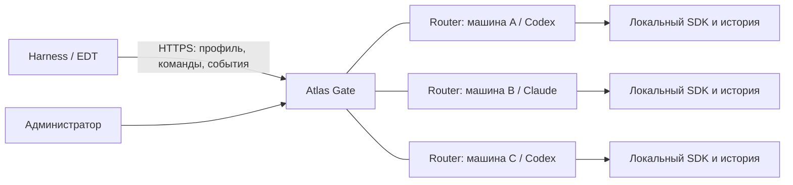

# Atlas Gate и Atlas Router: распределённая архитектура

Дата: 4 октября 2026 года. Статус: предлагаемая концепция для обсуждения и реализации.
Основа рекона: Router v0.6.0, дерево `e961337`. Работающая служба и профили этой концепцией не изменяются.

## 1. Решение

Два самостоятельных проекта, пакета, процесса и цикла выпуска:

- **atlas-gate** — центральный доступ клиентов, организации, устройства, политики,
  профили, квоты, аудит, регистрация Router и выбор исполнителя.
- **atlas-router** — устанавливаемый на разных машинах исполнитель агентного SDK:
  локальный вход Claude/Codex, беседы, инструменты клиента, компактизация и resume.

Gate подключает узлы логически: регистрирует, одобряет и включает в разрешённые пулы.
Физическое соединение может инициировать Router — это позволяет работать за NAT.
Harness/EDT знает адрес Gate; адреса, SDK-профили и учётные данные Router ему не выдаются.

**Разделение проектов не требует разделения машин.** Размещение Gate и Router
на одной машине — обязательный, полностью поддерживаемый вариант, включая
единственный локальный Router. Сервисы имеют отдельные процессы, конфигурацию,
порты и каталоги данных; используют тот же сетевой контракт через loopback.
Нельзя сохранять для этой установки особый путь через Python-импорты или общий registry.

| Размещение | Поддержка |
|---|---|
| Одна машина: Gate + один Router | Простой старт, совместная установка двух служб |
| Одна машина: Gate + несколько Router | Разные порты, каталоги и изолированные SDK-профили |
| Gate с локальным Router + удалённые Router | Смешанный парк, единые пулы и политики |
| Отдельная машина Gate + удалённые Router | Централизованный доступ без локального исполнителя |

Установщик может предлагать «Gate», «Router» и «Gate + Router», устанавливая
самостоятельные пакеты. Для совместной установки он создаёт локальный endpoint
и индивидуальные удостоверения; Router слушает только loopback, если удалённый
доступ ему не нужен. Привязка к localhost не отменяет проверку идентичности.
Внешние клиенты обращаются к Gate. Добавление удалённых узлов не требует
переустановки клиентов или переноса локальной истории.

Линии Gate—Router — аутентифицированные двусторонние каналы. Инструменты EDT/Harness
исполняет клиент: Router → Gate → tool_call → клиент → tool_result → Gate → Router.
Собственные серверные MCP остаются отдельной явно разрешаемой возможностью узла.

## 2. Разделение ответственности

| Область | Gate | Router |
|---|---|---|
| Вход сотрудника и регистрация устройства | Да | Не принимает пользовательские device tokens |
| Организации, роли, профили, политики данных | Источник истины | Проверяет выданное разрешение на исполнение |
| Выбор маршрута, пула и узла | Да | Проверяет собственную совместимость и лимиты |
| Вход ChatGPT/Claude и SDK credentials | Получает состояние готовности | Хранит локально; login выполняет оператор узла |
| Исполнение модельного хода и роли субагентов | Передаёт команды и учитывает расход | Да |
| Согласие на изменения в EDT | Централизованная политика | Передаёт вызов; непосредственное согласие и исполнение — у клиента |
| SDK-история, compact, карта Codex thread IDs | Хранит привязку публичной беседы | Хранит историю и локальную карту SDK |
| Буфер/журнал событий | Проксирует и хранит подтверждённый курсор | Первичный журнал событий хода |
| Квоты, бюджеты и аудит организации | Да | Локальная защита ресурсов и отчёт о фактическом usage |
| API-провайдеры DeepSeek/OpenAI/Anthropic | Прямой gateway-маршрут и его ключи | Только если появится отдельный согласованный тип исполнителя |
| Управление парком Router | Да | Применяет разрешённую конфигурацию и сообщает возможности |

У Gate нет зависимости на библиотеки Claude/Codex и локального входа в них.
У Router нет корпоративной БД, ключа подписи профиля и редактора организаций.
Общий контракт публикуется как спецификация/артефакт из одного из двух проектов,
без третьего сервиса и без циклических Python-импортов.

## 3. Почему текущую реализацию нужно менять

Сейчас `gate/agent.py:Delegated` вызывает внутреннее ASGI-приложение, а создание
сессии, проверка владения и `_watch_usage` читают `app.state.registry` и TurnBuffer.
В `GateState` словари `owners` и `agent_routes` живут в памяти процесса. БД сохраняет
владельца SDK sessionId, но не распределённую привязку Gate session → конкретный узел.
`GateState._agent_model_ids` и здоровье связаны с единственным локальным backend.

Следовательно, переноса папки `gate` в другой репозиторий недостаточно. Нужны
сетевой RouterClient, постоянная карта сессий и событийный контракт usage.
Существующие `/harness/*` и схема событий для клиента по возможности сохраняются.

## 4. Узлы, исполнители и пулы

Различать три сущности:

- **Node**: установка Router, постоянный `node_id`, отдельная криптографическая
  идентичность, версия протокола и новый `boot_id` после каждого запуска.
- **Executor**: конкретный backend/профиль входа на узле. Один узел первоначально
  содержит один executor; контракт допускает несколько изолированных профилей.
- **Pool**: разрешённый организации набор исполнителей с нужным backend,
  моделью, возможностями, классом данных и ограничениями владельца аккаунта.

Например, `codex-team` объединяет Codex-исполнителей A и C, а `claude-team` — B.
Логический `route_id` у клиента обозначает пул/маршрут, а не IP машины.
Имя backend не следует кодировать в обязательный глобальный идентификатор маршрута.
Существующий `claude-sub` можно временно сохранить как совместимый ID; его миграция
должна отдельно учитывать историю, закреплённые версии агентов и клиентов.

Node сообщает модели и возможности. Администратор разрешает их использование.
Итоговый каталог организации — пересечение: конфигурация организации ∩ одобренные
пулы ∩ совместимые возможности исполнителей. Само объявление узла не даёт доступ.

Для краткого исчезновения узла сохраняется последний утверждённый каталог моделей
с признаком временной недоступности. Каждая пропажа heartbeat не должна удалять
агентов и выпускать новый профиль организации. Изменение разрешений или утверждённого
каталога, напротив, меняет подписанный профиль.

## 5. Подключение и безопасность

Последовательность регистрации: установка → локальный ключ узла → одноразовое
приглашение Gate → одобрение администратором → сертификат узла → проверка
возможностей и входа SDK → включение в пул.

Приглашение короткоживущее, одноразовое и привязано к заявке/пулу. Один общий
`X-Atlas-Token` для всего парка заменяется индивидуальными удостоверениями.
Отзыв узла прекращает его доступ; сертификаты обновляются до истечения срока.
ID узла берётся из проверенного удостоверения, а не из произвольного заголовка.
При перевыпуске установки старая идентичность явно отзывается.

Рекомендация: mTLS между Gate и Router, раздельные идентичности узлов и пользователей.
SPIFFE задаёт практику идентичностей workload; SPIRE — возможная следующая ступень
при большом парке, а первоначально достаточно управляемого CA и автоматической
ротации сертификатов. [SPIFFE](https://spiffe.io/docs/latest/spiffe-about/overview/),
[RFC 8705](https://www.rfc-editor.org/rfc/rfc8705).

Каждая команда несёт разрешение, ограниченное `org_id`, `node_id`, executor,
беседой, действием, политикой и сроком. Router отвергает чужой адресат, просроченный
срок и неразрешённую операцию. Разрешение Gate не подменяет согласие на инструмент
в клиенте. Отдельно ограничиваются shell, серверные MCP и другие локальные действия.

SDK credentials остаются в профиле нужной учётной записи ОС на Router. Gate знает
только readiness и непрозрачный идентификатор аккаунта/лимитной группы. Общая
аутентификация Gate не означает права пользоваться любым подписочным аккаунтом:
пул привязывается к одобренной организации/владельцу и допустимым пользователям.
Особенность Codex: CLI/IDE могут разделять локальный кеш входа; logout влияет
на связанные процессы. [Официальная аутентификация Codex](https://learn.chatgpt.com/docs/auth).

Оператор входит в SDK на узле через локальную админку или штатный CLI. Gate не
пересылает OAuth-код, auth.json и не запускает произвольную команду на Router.
Внешний адрес Router не задаётся обычным клиентом. Для direct-режима администратор
утверждает адрес и сертификат, сетевой доступ ограничен; автоматические redirects
отключены. Это предотвращает использование реестра как SSRF/open proxy.
[OWASP SSRF](https://cheatsheetseries.owasp.org/cheatsheets/Server_Side_Request_Forgery_Prevention_Cheat_Sheet.html).

## 6. Сеть: два транспорта, один контракт

| Режим | Применение | Решение |
|---|---|---|
| Direct HTTPS/mTLS | Gate видит узлы в LAN/VPN | Самый простой первый этап; сохраняет HTTP/SSE/polling |
| Исходящий connector Router → Gate | Рабочие машины за NAT, без входящих портов | Целевая возможность; канал двусторонний после соединения |

Практика исходящего подключения применяется в Cloudflare Tunnel: узел сам
устанавливает соединение, далее трафик идёт в обе стороны. Заимствуем принцип,
не вводим обязательную зависимость на Cloudflare.
[Документация Tunnel](https://developers.cloudflare.com/cloudflare-one/networks/connectors/cloudflare-tunnel/).

Для первого внедрения рекомендую private LAN/VPN + HTTPS/mTLS. Если NAT нужен
сразу, использовать проверенный защищённый туннель поверх этого HTTP-контракта.
Собственный multiplexed connector добавлять отдельным этапом: предпочтительно
на зрелом HTTP/2/gRPC-стеке, с request IDs, независимыми потоками, ограничениями
размера/очередей и давлением обратного потока. Не превращать connector в удалённый shell.

Heartbeat приложения сообщает readiness/executor load; transport keepalive
подтверждает только соединение. Они не доказывают способность SDK выполнить ход.
[gRPC keepalive](https://grpc.io/docs/guides/keepalive/).

## 7. Маршрутизация и вместимость

При создании беседы Gate отбирает узлы по политике организации, аккаунтной группе,
backend/model, минимальной версии, поддержке compact/steer/ролей/вложений,
классу данных, readiness и свободным лимитам. Среди пригодных узлов выбирает
наименее загруженный и атомарно резервирует нужную ёмкость. Очередь ограничена.

### 7.1. Что означает «самый доступный и свободный»

Сначала применяются обязательные фильтры: узел одобрен и доступен, сведения
достаточно свежие, SDK вошёл в аккаунт, модель/политика совместимы, нет drain,
cooldown и исчерпанных известных лимитов узла или аккаунтной группы. Узел с
неизвестной готовностью не получает новую сессию до успешной сверки.

Затем Gate сравнивает пригодных кандидатов по нормированной занятости:
`load = (active_units + reserved_units) / configured_capacity`.
Единицы учитывают основной ход и нагрузку субагентов; коэффициенты задаются
конфигурацией и уточняются измерениями. Нельзя сравнивать только число бесед:
сохранённая неактивная беседа и выполняющийся ход расходуют разные ресурсы.
При близкой нагрузке учитываются известный запас подписочного лимита,
очередь и наблюдаемая задержка; равные кандидаты выбираются с распределением
ничьих, чтобы первый узел в списке не получал все запросы.

Остаток подписочной квоты используется только при наличии достоверного
SDK-сигнала с временем измерения. Неизвестный остаток не означает 100% свободной
квоты. При отсутствии такого сигнала работают лимиты параллелизма, фактическая
нагрузка, наблюдаемые rate limits и cooldown; точный запас токенов не обещается.

Выбор и резервирование выполняются одной транзакцией/CAS с учётом уже выданных
резервов: одновременные запросы не должны все видеть один последний свободный
слот. Gate учитывает резерв сразу, до следующего heartbeat; Router окончательно
подтверждает возможность принять работу. Заведомый отказ до создания беседы
позволяет освободить резерв и выбрать следующего кандидата. Потерянный ответ
требует запроса статуса по request_id на том же узле: создание на другом узле
разрешается только после подтверждения, что первое не состоялось.

Резерв на создание беседы и резерв на выполнение хода имеют разные сроки и
назначение. Пустая беседа не удерживает слот активного хода бессрочно. При первом
prompt Gate заново резервирует ёмкость на закреплённом Router; при его занятости
показывает ожидание/отказ по политике очереди. Он не переносит уже созданную
беседу на более свободную машину. Истечение резерва на неизвестную операцию
само по себе не является доказательством, что операция не выполнилась.

Например, A занят на 3 из 4 слотов, B — на 1 из 4, C находится в cooldown:
новая беседа выбирает B, если все остальные ограничения совместимы. После
создания её следующие команды продолжают идти в B, даже если A освободился.

Лимиты различаются: число сохранённых бесед, активных модельных ходов, дочерних
агентов, процессов SDK и допустимый параллелизм подписочного аккаунта. Router
может самостоятельно отказать в слоте; реклама capacity не считается гарантией.
Субагенты учитываются в общей вместимости. Несколько узлов одного аккаунта
не считаются независимыми квотами этого аккаунта.

Rate limit одного аккаунта помещает в cooldown всю соответствующую группу,
ошибка модели — только модель, недоступность машины — узел. Ошибки политик
пользователя не понижают здоровье Router. Health checks дополняются наблюдением
ошибок и circuit breaker; чтение health не должно выполнять платный модельный запрос.
[Envoy outlier detection](https://www.envoyproxy.io/docs/envoy/latest/intro/arch_overview/upstream/outlier),
[circuit breaking](https://www.envoyproxy.io/docs/envoy/latest/intro/arch_overview/upstream/circuit_breaking).

Начальные интервалы как параметры MVP: heartbeat 10 секунд, подозрение после
трёх пропусков, reconnect с экспоненциальной задержкой и jitter. Значения проверить
на рабочих сетях; один пропуск не должен прерывать беседу.

## 8. Беседа закреплена за исполнителем

Gate создаёт собственный публичный `session_id` и сохраняет:
`org/device/user → route/pool → node/executor → router_session_id → SDK handle`.
Также сохраняются разрешённая модель, policy revision, владелец, состояние и
поколение владения. SDK handle может быть локальным алиасом Codex, а не переносимым
native thread ID. Клиенту достаточно непрозрачного публичного идентификатора.

Все prompt/tool_result/steer/interrupt/tools/compact/stop_task этой беседы идут
к выбранному Router. Балансировка по IP клиента или round-robin каждого HTTP-запроса
для этого непригодны. Переподключение Gate не должно сменить владельца беседы.

### 8.1. Защита от перепутанных маршрутов

Публичный session_id уникален на Gate. Локальный router_session_id уникален
только внутри пары node_id/executor_id: одинаковые локальные IDs двух Router
не являются одной беседой. Привязка хранится в БД с ограничениями уникальности,
а не вычисляется заново из текущего «самого свободного» узла.

При каждой команде Gate проверяет владельца и организацию публичной сессии,
загружает сохранённую привязку и отправляет ожидаемые node/executor/session,
turn_id, request_id и generation. Router проверяет адресата, разрешение,
поколение и принадлежность локальной сессии. Для tool_result дополнительно
проверяется ожидающий call_id в нужном ходе; для субагента — связь с родителем.
Несовпадение отвергается явной ошибкой, без подстановки другой сессии.

Ответы и события проверяются по аутентифицированному узлу и той же привязке.
Поздний ответ старого boot/generation допускается только в рамках явной сверки
известной операции; он не может переключить текущую сессию. Параллельные ходы
одной беседы сериализуются или явно отклоняются согласно контракту backend.
В админке отображаются публичная сессия, её узел/исполнитель, нагрузка и причина
недоступности; аудит фиксирует выбор, резерв и смену состояния привязки.

| Событие | Предлагаемое поведение |
|---|---|
| Потеря клиентского SSE | Клиент возобновляет чтение по курсору; отмена выполняется явным interrupt |
| Потеря канала Gate—Router | Беседа suspended; Gate не запускает второй prompt; reconnect и сверка состояния |
| Перезапуск Gate | Привязка восстанавливается из БД; Router сверяет действующие команды и курсоры событий |
| Перезапуск того же Router | Новый boot_id; сверка локального журнала, прерванный ход помечен явно; resume из истории SDK |
| Выход SDK-аккаунта | Новые ходы запрещены; существующая беседа остаётся с причиной login_required |
| Безвозвратная потеря узла | resume_unavailable; перенос только через заранее подготовленный checkpoint и явную политику |
| Плановое обновление | draining: новые беседы запрещены, текущие завершаются, затем узел останавливается |

Изменение семантики SSE — отдельный совместимый этап. В v0.6.0 Router обрывает
SSE-ход при disconnect; Gate должен сначала использовать поддерживаемый async
prompt + чтение событий и отдельно протестировать явную отмену на стороне клиента.

Автоматическое бесшовное перемещение native SDK-истории между машинами не обещаем:
форматы, версии, локальные карты и профиль входа привязаны к исполнителю.
Checkpoint может включать выжимку и события клиента; продолжение на другом узле
создаёт новую SDK-историю с явно указанной потерей точности относительно полного resume.
Pending tools должны быть разрешены/помечены неопределёнными до любого переноса.

Если будущая схема позволяет менять владельца, нужны монотонное поколение и
lease/fencing: старый узел не принимает новые команды старого поколения. Это не
останавливает уже отправленный внешний вызов, поэтому активный ход нельзя просто
дублировать после истечения lease. Сначала сверить результат или признать его неопределённым.

## 9. Доставка, повторы и расход

Транспорт предполагает возможную повторную доставку. Каждая меняющая состояние
команда имеет `request_id`; Router сохраняет ключ, fingerprint параметров и итог
в журнале до/вместе с принятием операции. Тот же ключ с другими параметрами — conflict.
При неясном исходе Gate сначала запрашивает статус команды, а не выбирает другой узел.
Практика client request IDs и атомарной дедупликации описана в
[AWS Builders' Library](https://aws.amazon.com/builders-library/making-retries-safe-with-idempotent-APIs/).

Router хранит события `(session_id, turn_id, event_seq)` и конечный результат.
Gate/клиент подтверждает курсор; reconnect читает начиная с последнего подтверждённого.
События tool_call/result/error не теряются при свёртке delta. По истечении retention
возвращается явный event_history_expired с итоговым snapshot, а не пустой успешный ответ.
Дедупликация control/event delivery не гарантирует exactly-once внешнего SDK или
неидемпотентного инструмента: возможное выполнение после сбоя называется явно.

Gate резервирует корпоративную квоту до принятия prompt, Router подтверждает приём.
Заведомый отказ возвращает резерв; потеря ACK оставляет состояние pending/unknown
до сверки. Фактический usage приходит событием с уникальным ID и записывается один раз.
Итог хода, потраченные токены и состояние квоты восстанавливаются после перезапуска.
Стоимость подписки остаётся null при отсутствии достоверной цены.

## 10. Контракт между проектами

Сохранить клиентскую поверхность Gate `/harness/*`. Внутренний API Router
отдельно версионируется; минимальный набор включает:

- register/approve/revoke и обмен удостоверениями;
- capabilities: версии, backend/models, readiness, ограничения и признаки функций;
- create/resume/close session;
- prompt и status команды/хода;
- events after cursor и acknowledgement;
- tool_result, steer, interrupt, set_tools, compact, stop_task;
- usage, reconcile, drain и ограниченную диагностику.

Это проектирование контракта, а не список уже существующих маршрутов. В конверте
нужны `protocol_version`, `request_id`, `trace_id`, публичный/локальный session ID,
turn/call/task ID, boot_id и generation. API не должен принимать произвольный путь
для проксирования или произвольную ОС-команду. Attachments имеют ограничения размеров,
общую ссылку/объект только при необходимости, срок жизни и digest для проверки целостности.

Ошибки различать по смыслу: policy_denied, incompatible_capability, capacity_exceeded,
login_required, node_unavailable, session_suspended, resume_unavailable,
command_outcome_unknown, event_history_expired. Клиент получает actionable состояние.
Публичные события и имена инструментов остаются независимы от конкретного SDK.

## 11. Хранилища и наблюдаемость

В Router: локальная история SDK, карты Codex, durable commands/events/session index.
В Gate: организации/устройства/профили, удостоверения узлов, пулы, привязки сессий,
резервы квот, usage и аудит. Общий диск с OAuth-кешем для всех Router не используется.
В MVP достаточно отдельной SQLite/WAL каждого сервиса и одного активного Gate.

Несколько экземпляров Gate потребуют транзакционного общего хранилища, согласованной
сессии владения, доступа к connector и уведомлений между экземплярами. PostgreSQL
может быть отдельным ADR для этой задачи. Это не возврат отменённой схемы
LiteLLM/Postgres и не обязательная зависимость начального разделения. Redis, брокер
и Kubernetes также не добавляются только ради двух проектов.

Metrics: ready executors, active turns/subagents, очередь, SDK/login failures,
latency до первого события, потеря ACK, reconnect, event lag, usage reconciliation.
Корреляция запроса проходит через Gate и Router с trace context; SDK-секреты,
полные промпты и содержимое инструментов не попадают в технические логи по умолчанию.
[OpenTelemetry traces](https://opentelemetry.io/docs/concepts/signals/traces/).
Retention технического журнала, истории клиента и бизнес-аудита задаётся раздельно.

## 12. Последовательность реализации

1. Зафиксировать контракт и parity matrix; в текущем проекте ввести RouterClient,
   убрать прямое чтение registry/TurnBuffer из Gate. Первоначально сетевой адрес localhost.
2. Выпустить отдельный **atlas-gate** с сохранением `/harness/*`, SQLite, устройств,
   ключа подписи и истории профилей. SDK-пакеты остаются только в **atlas-router**.
3. Добавить registry узлов, mTLS, утверждение capabilities, пулы, постоянную
   привязку бесед и atomic capacity/quota reservations. Два Router на разных машинах.
4. Добавить durable command/event journals, reconciliation и drain. Подтвердить
   перезапуски Gate/Router и потери сети, включая pending tool_result.
5. Добавить NAT connector, если выбран для эксплуатации; протестировать reverse
   соединение, ротацию удостоверений, reconnect storm и backpressure.
6. Отдельно решить HA Gate и перенос бесед. Не включать перенос активного prompt
   в MVP как неподтверждённую гарантию.

Сначала совместная установка двух служб на текущей машине, затем второй Router
на отдельной. Клиенты продолжают обращаться к прежнему Gate URL. Миграция данных,
SDK-профиля и карт resume выполняется с бэкапом и явной таблицей соответствия IDs.
Совместная установка остаётся поддерживаемым режимом после всех этапов, а не
временным средством миграции. Каждый сервис можно обновлять и перезапускать отдельно;
совместимость версий проверяется при подключении. Отказ всей общей машины теряет
одновременно Gate и локальные Router — такое размещение само по себе не даёт HA.

## 13. Критерии приёмки

- Gate запускается без SDK и без доступа к профилям входа Router.
- Router запускается без корпоративной БД и без ключа подписи Gate.
- Два Router на разных машинах обслуживают один Gate; клиент знает только Gate.
- Gate и Router на одной машине проходят тот же набор сценариев, включая compact,
  tools, субагентов, resume и независимый перезапуск каждой службы.
- Совместная установка поддерживает несколько локальных Router с изолированными
  портами/данными и одновременное подключение удалённого Router.
- Новые сессии распределяются по разрешённым узлам; все управляющие команды
  существующей беседы возвращаются к её владельцу.
- Выбор новой сессии проверен при разной нагрузке, равной нагрузке, старом
  heartbeat, drain, logout и rate limit. Неизвестная квота не считается полной.
- Одновременное создание сессий не превышает capacity; потеря ответа create
  не создаёт копию на другом Router. Общий аккаунт учитывается как одна лимитная группа.
- Два Router с одинаковыми локальными session/call IDs не смешивают историю,
  tool_result, события или usage. Чужой org/device, неверный адресат и старое
  поколение отвергаются; после перезапуска Gate привязка сохраняется.
- Разрешения организации и capability/model/account ограничения соблюдаются
  для основного хода и всех дочерних агентов.
- Перезапуск Gate сохраняет владельца, cursor, квоту и usage; повтор команды
  не создаёт вторую беседу/ход и не учитывается дважды.
- Сбой Router во время клиентского инструмента показывает неопределённый исход,
  не повторяет изменение и не выдаёт пустую историю за успешный resume.
- Compact и Codex mapping восстанавливаются на прежнем Router после перезапуска.
- Отключение/отзыв/drain узла, rate limit аккаунта и несовместимая версия
  не ломают остальные пулы; состояние отображается в админке и клиенте.
- NAT, большие вложения, SSE/polling, три субагента и медленный клиент проверены
  через обе сетевые границы. Сертификаты и SDK credentials не уходят в клиент.

Предлагаемое первое решение: **два проекта, один Gate, несколько одобренных Router,
закреплённые сессии, индивидуальная идентичность узлов и совместимый HTTP-контракт**.
Это достаточная основа для распределённой системы без обещания бесшовного переноса
SDK-истории или преждевременного введения большой инфраструктуры.
